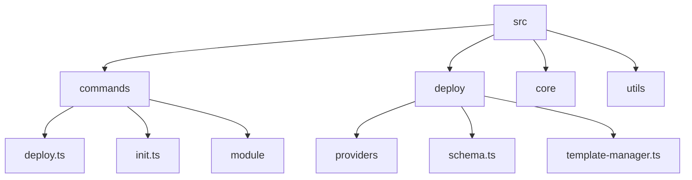

# @nexical/cli

The official Command Line Interface (CLI) for the Nexical framework.

This project serves as the primary entry point for managing Nexical projects, handling tasks such as project initialization, module management, and development workflows. It is designed to be **extensible**, **fast**, and **developer-friendly**, focusing on a clean architecture that allows for easy addition of new commands.

## Table of Contents

- [Purpose](#purpose)
- [Architecture & Design](#architecture--design)
- [Getting Started](#getting-started)
- [Project Structure](#project-structure)
- [Development Workflow](#development-workflow)
  - [Prerequisites](#prerequisites)
  - [Setup](#setup)
  - [Running Tests](#running-tests)
- [Adding New Commands](#adding-new-commands)
- [Contributing](#contributing)
- [License](#license)

---

## Purpose

The Nexical CLI allows developers to:

1.  **Initialize** new Nexical projects with best practices built-in.
2.  **Manage** project configuration and dependencies.
3.  **Extend** the framework functionality through modular commands.

It acts as a unification layer, bringing together various tools and configurations into a cohesive developer experience.

## Architecture & Design

This CLI is built with **TypeScript** and follows a **Class-Based Command Pattern** to ensure type safety and maintainability.

### Key Technologies

- **[CAC (Command And Conquer)](https://github.com/cacjs/cac)**: A lightweight, robust framework for building CLIs. It handles argument parsing, help generation, and command registration.
- **[Consola](https://github.com/unjs/consola)**: Elegant console logging with fallback and structured output capabilities.
- **[Lilconfig](https://github.com/antonk52/lilconfig)**: Configuration loading (searching for `nexical.yml`, `nexical.yaml`) akin to `cosmiconfig` but lighter.
- **Vitest**: A blazing fast unit test framework powered by Vite.

### Core Components

1.  **`CLI` Class** (`src/core/CLI.ts`): The orchestrator. It initializes the CAC instance, discovers commands using the `CommandLoader`, registers them, and handles the execution lifecycle.
2.  **`CommandLoader`** (`src/core/CommandLoader.ts`): Responsible for dynamically discovering and importing command files from the filesystem. It supports:
    - Recursive directory scanning.
    - Nested commands (e.g., `module/add.ts` -> `module add`).
    - Index files as parent commands (e.g., `module/index.ts` -> `module`).
3.  **`BaseCommand`** (`src/core/BaseCommand.ts`): The abstract base class that all commands MUST extend. It provides:
    - Standardized `init()` and `run()` lifecycle methods.
    - Built-in access to global options (like `--root-dir`).
    - Helper methods for logging (`this.log`, `this.warn`, `this.error`).
    - Project root detection (`this.projectRoot`).

### Design Goals

- **Zero-Config Defaults**: It should work out of the box but allow rich configuration via `nexical.yaml`.
- **Extensibility**: Adding a command should be as simple as adding a file.
- **Testability**: Every component is designed to be unit-testable, with dependency injection where appropriate (e.g., `CommandLoader` importer).

---

## Getting Started

### Installation

While currently in development, you can run the CLI from the repository source or link it.

```bash
# From within the package directory
npm install
npm run build
```

### Usage

```bash
# Run the built CLI
nexical <command> [options]

# Example: Initialize a new project
nexical init my-new-project

# Get help
nexical help

# Get help for a specific command
nexical help init
nexical help module add
```

### Command Reference

#### `init`

Initializes a new Nexical project. It clones a starter repository, sets up submodules, installs dependencies, and resets the Git history to provide a clean starting point.

**Usage:**

```bash
nexical init <directory> [options]
```

**Options:**

- `--repo <url>`: The Git repository URL of the starter template (Default: `https://github.com/nexical/app-core`).

---

#### `deploy`

Orchestrates the deployment of your applications by interacting with cloud providers and configuring your repository's CI/CD environment.

**Usage:**

```bash
nexical deploy [options]
```

**Options:**

- `--env <environment>`: Deployment environment (e.g., `production`, `staging`). Defaults to `production`.
- `--apps <apps>`: Comma separated list of applications to deploy (e.g., `backend,frontend`). If omitted, all applications are deployed.
- `--dry-run`: Simulate the deployment process without making API calls to providers or modifying repository secrets.

**Process:**

1.  **Load Config**: Reads `nexical.yaml` and validates the schema.
2.  **Provision**: Concurrently calls providers to ensure resources exist.
3.  **Sync Secrets**: Collects necessary API tokens and credentials, syncing them to the repository (e.g., GitHub Secrets).
4.  **Generate Workflows**: Renders CI/CD workflow files into `.github/workflows/` using standard templates.

**Configuration (`nexical.yaml`):**

```yaml
deploy:
  repository:
    provider: github
  apps:
    backend:
      provider: railway
      projectName: my-api
      target: apps/backend
      artifactPath: dist
      buildCommand: npm run build --workspace=@app/backend
      secrets:
        DB_PASSWORD: DATABASE_PASSWORD_ENV # Maps provider secret to local ENV var
      env:
        NODE_ENV: production # Literal value
    frontend:
      provider: cloudflare
      projectName: my-web
      target: apps/frontend
      artifactPath: dist
      buildCommand: npm run build --workspace=@app/frontend
```

---

#### `prompt`

Packages the project context using `repomix` and runs AI-powered analysis or generation.

**Usage:**

```bash
nexical prompt [options]
```

**Options:**

- `--output <path>`: Path to save the packed context file.
- `--config <path>`: Custom configuration for the prompt runner.

---

#### `setup`

Prepares the local development environment, ensuring all necessary tools and configurations are in place.

**Usage:**

```bash
nexical setup
```

---

#### `run`

Executes a command or script within the Nexical project context, handling environment variables and path resolution.

**Usage:**

```bash
nexical run <script> [args...]
```

---

#### `module`

Manages the modular components of your project.

- **`module add <url> [name]`**: Adds a new Git-based module as a submodule.
- **`module list`**: Displays a table of all installed modules.
- **`module update [name]`**: Updates a specific module or all modules to their latest remote versions.
- **`module remove <name>`**: Safely removes a module and cleans up Git metadata.

---

#### `dev` / `build` / `preview`

Standard development cycle commands inherited from the underlying app structure (typically Astro).

---

## Project Structure



- **`src/commands/`**: Command implementation classes.
- **`src/deploy/`**: Core logic for the deployment orchestration system.
- **`src/core/`**: CLI framework (base classes, loader).
- **`src/utils/`**: Helper utilities.

---

## Development Workflow

### Prerequisites

- Node.js (v18+)
- NPM/PNPM

### Setup

```bash
npm install
npm run build # Required to generate dist/ for local execution
```

### Running Tests

We maintain strict **100% test coverage** for all logic.

```bash
npm run test           # All tests
npm run test:unit      # Unit tests
npm run test:integration # Integration tests
```

---

## Contributing

1.  Fork the repo and create a branch.
2.  Implement changes with accompanying tests.
3.  Ensure 100% coverage: `npm run test:unit`.
4.  Submit a PR.

---

## License

Apache License 2.0
